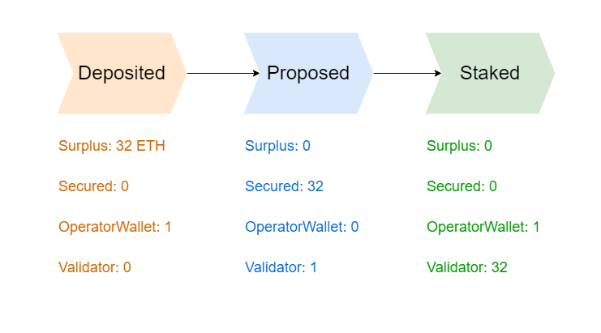

# Deep Dive

geonius internal structure is explained.

## Validator Creation

Pool owners can delegate any amount of validators to Node Operators.
When there are enough funds (32 ETH per validator) in the pool, any of the Node Operators that is registered in the Operator Marketplace, can create validators up to their allowance.

Then,

1. Validator pubkey is proposed by the Node Operator
   1. Initiates the validator on beaconchain.
   2. Operator uses 1 eth to secure the proposal, no funds leave the staking pool yet.
2. The proposal is approved by the Oracle.
   1. This happens regularly with at most 24 hours delay.
3. The Node Operator finalizes the validator creation.
   1. Node Operator gets the 1 ETH back into their internal wallet.

## Daemons and Triggers

To make the above process happen we use multiple daemons which just mostly watch the Portal smart contract for events, or the beacon chain for changes.

There are 3 type of daemons:

1. Time Daemon: triggers the provided task every x second.
2. Block Daemon: triggers the provided task every x block.
3. Event Daemon: triggers the provided task every time there is a new event from the provided smart contract. Mostly, Portal or gETH contracts.

### IdInitiated Daemon

Watches the `IdInitiated` events.

Triggered when a new pool is created. Creates and/or updates the new pool on the database.

Checks if there are any new possible validators to propose.

### Deposit Daemon

Watches the `Deposit` events.

Triggered when there is a new deposit for the pool, which increases the `surplus`.

Updates the database with the latest info.

Checks if there are any new possible validators to propose for given pool.

### Delegation Daemon

Watches the `Delegation` events.

Triggered when a pool changes the Allowance for the operator.

Updates the database with the latest info by saving delegation events.

Checks if there are any new possible validators to propose.

### FallbackOperator Daemon

Watches the `FallbackOperator` events.

Triggered when a pool changes it's fallback operator.

Checks if there are any new possible validators to propose.

### StakeProposal Daemon

Watches the `StakeProposal` events.

Triggered when a new validator is proposed.

Just updates the validator on the database, when the deposit is processed by the beacon chain.

### Stake Daemon

Watches the `Stake` events.

Triggered when a validator is activated on Portal.

Only functions to update the validator on the database when the balance change is detected on the beacon chain.

### Alienated Daemon

Watches the `Alienated` events.

Alienation is important because when a validator is Alienated it's Operator will be prisoned.

### ExpectPubkeys Daemon

This is a time daemon that runs every 15 minutes.

It checks if a deposit is processed according to the provided filter. Then, it updates the database accordingly.

### ExitRequest Daemon

Watches the `ExitRequest` events.

Inititates the validator exit.
