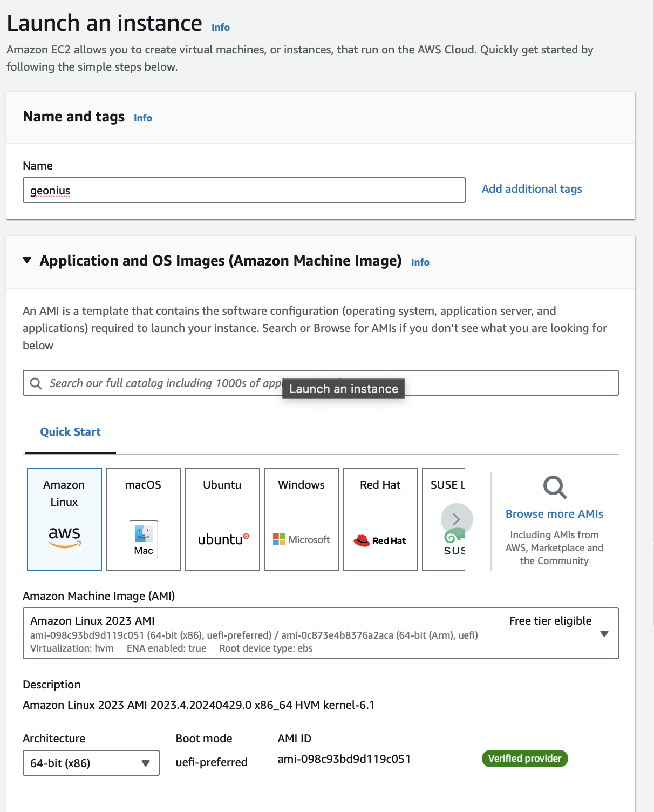
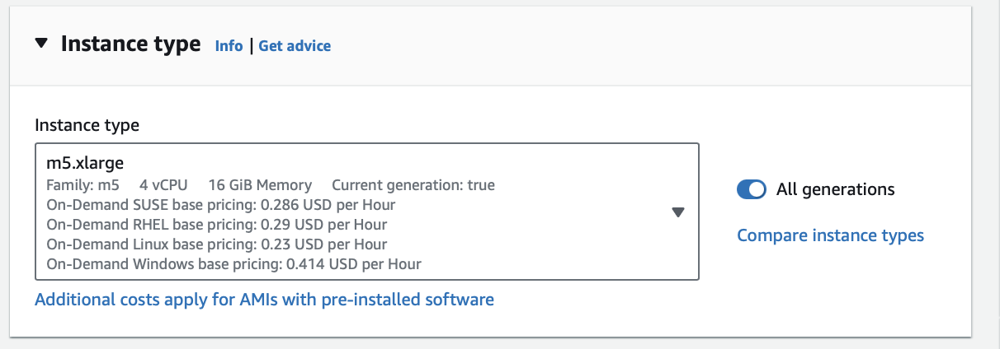
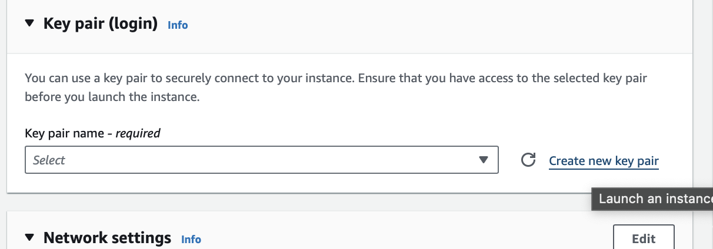
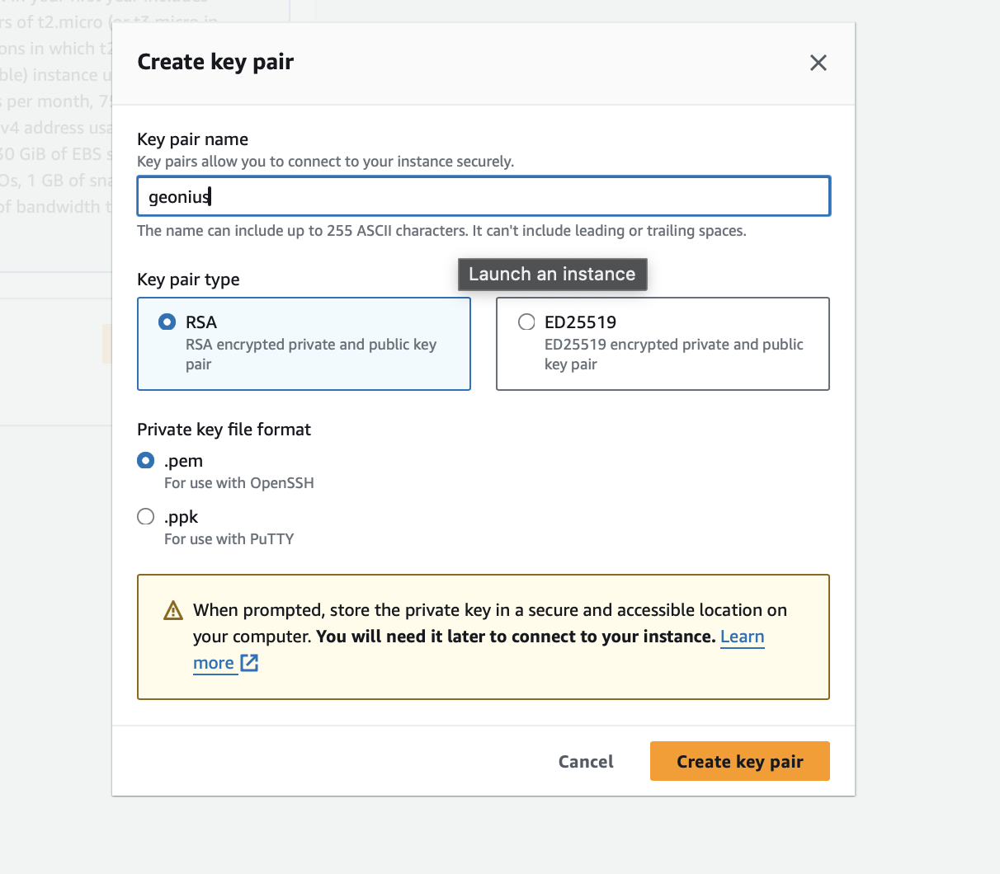
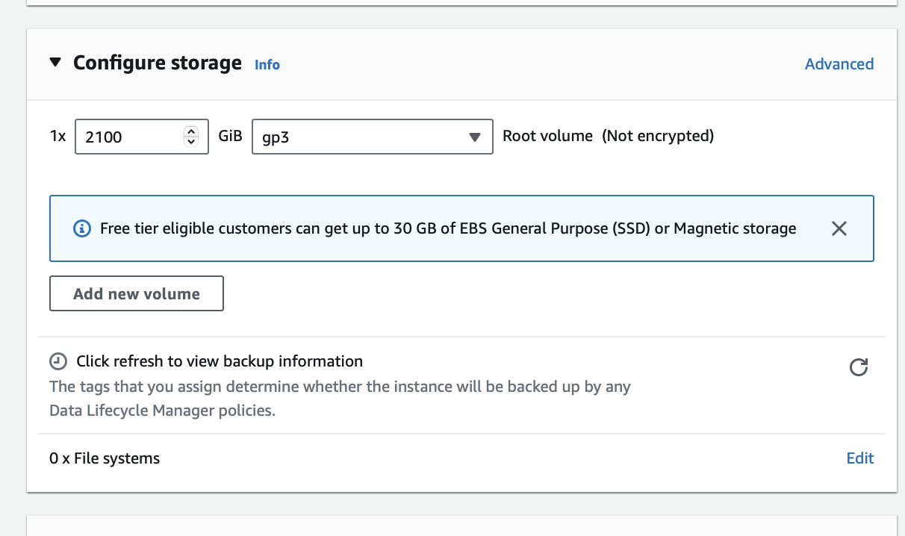

# Create an AWS instance

In this post, I’ll describe a step-by-step process to setup a full Geth node on AWS EC2

<!-- TODO: This is an internal guide, should be removed later. -->

This post is written on `May 2024`. The systems you need to use may vary depending on the date. This tutorial is for the user with basic-devops skill.

### Step 1

Navigate to `EC2` > `Instances` > `Launch instances`.


### Step 2

Select the **m5.xlarge** instance type, featuring 16 GiB RAM and 4 vCPUs.


### Step 3

If you do not already have a key-pair, click create key pair and create a file with the .pem extension.

>Use the .pem file only for this instance and never share or lose it!




### Step 4

A 2TB SSD will be enough for ethereum mainnet. However, there might be a better setup for this with elastic storage.


### Step 5

Connect!

```bash
chmod 400 geonius.pem

ssh -i geonius.pem ubuntu@ec2-3-44-55-66.compute-1.amazonaws.com
```

> Do not forget to utilize screens:
>
> ```
> # create session
> screen -S geth/vouch/nimbus/ethdo
> # reattach session
> screen -r geth/vouch/nimbus/ethdo
> # deattach session
> screen -d geth/vouch/nimbus/ethdo
> ```
